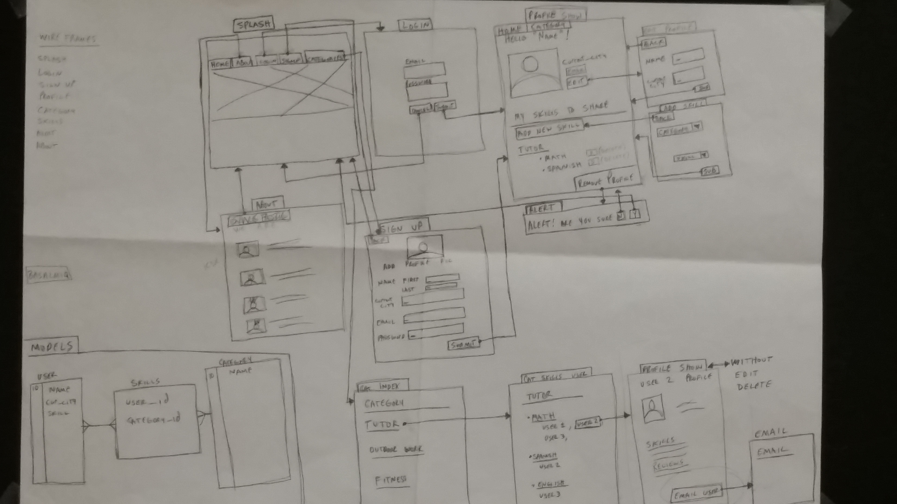

# Sharetastic
A users can list skills on their profile that others can see in an organized fashion on our site. A second user can then sign in and email a selected user based on the desired skill to arrange a skill trade.

## Contents
* **[Getting Started](#getting-started):** How can you work with our code?
* **[Wireframes](#wireframes):** How did we envision the application's user interface?
* **[User Stories](#user-stories):** How did we plan our features and organize them into sprints?
* **[Heroku Link](#heroku-hosted-project)**
* **[Technologies](#technologies):** What languages, gems, libraries, and frameworks are being used?
* **[Future Development](#future-development):** What are we hoping to add?
* **[Contributors](#contributors):** Who made all of this happen?

# Getting Started
1. Fork this repo and clone it onto your local machine.
2. Change directory into our `share` directory.
2. Run `bundle install` to install gems.
3. ImageMagick must be installed on your machine (Mac OS X - `brew install imagemagick`, Ubuntu - `sudo apt-get install imagemagick -y`).
4. Run `rake db:setup` to create and migrate the database (PostgreSQL must be installed on your machine).
5. Run `rails s` to start the server locally.

# Wireframes

# User Stories

## Sprint 1

1. User can see a background/jumbotron image on the splash page.
2. User can see a navbar with links to "login", "sign up".
3. User can click on login link and be sent to the login page.
4. User can click on sign up link and be sent to the signup page.
5. User can click on about and be sent to the about page with images/pics of developers.
6. User can input text into "Email" and "Password" fields.
7. If email and password match user info, user can be sent to his/her profile page.
8. If email and password do not match user info, user can see an error message and be sent back to login page.
9. User can see a form with fields for "Email" and "Password" and a button for "Login."
10. Fix/add bootstrap.
11. The user will fill in the fields and click Submit. If all the forms are filled with the correct data types, the user will be directed to their profile page and a welcome to the sight message will be displayed. If the user has not completed all the forms correctly, or left some blank. An error message will be displayed and the user will have to retype in all the fields and hit submit again.
12. User will see a form on the page with the following fields: first name, last name, email and city.
13. Set up paperclip.
14. User will see their image and the information entered on the form on their page.

## Sprint 2

1. User will see a navbar on all pages displaying: home, about, login, signup, category.
2. When user clicks on the link they will be directed to the page clicked on.
3. On the profile show page a user can click the delete profile button. A message will appear asking "Are you sure you want to delete yourself?". If the user clicks yes then they will be redirected to the splash page. If the user clicks no they will be directed to their profile page.
4. User will be able to click on the edit profile button and be redirected to the edit profile page.
5. User will see a form pre populated with existing profile info. The user can update these fields.
6. User can press the Submit key and be redirected to the profile show page.

## Sprint 3

1. A user can see a page loaded with all the possible categories for our site.
2. A user can click a category link and will be directed to the category show page.
3. A user will see all the skills associated with the category.
4. User can see a default photo for paper clip.
5. User can see a basic layout on the about us page.

## Sprint 4

1. User will see a list of categories (with skills associated).
2. Clicking a skill will add it to user profile.
3. User can see an add skill button.
4. User can click on categories and be sent to the categories#index page.
5. Add skill button to nav bar.
6. Add skills under categories.
7. A user can click on a user whose skill they desire and they will be directed to that users profile page.
8. A user will see the users associated with each skill.

## Sprint 5

1. Add before action to skill
2. User can click the delete skill button located next to each skill and delete that skill.
3. A flash confirmation message will appear. If the user clicks yes, then the skill will disappear and the user will remain on the profile page. If the user clicks no, the user will remain on the profile page.
4. User will be able to send an email to a user whose services they are interested in by clicking on an "email me" button.
5. Change error notice for incorrect email.
6. If not signed in, you can't see a users email link.
7. User can't add the same skill twice.
8. Use user-friendly URL IDs.
9. User can't see email me button on their own profile.

---

# Heroku hosted project
<a href="https://sharetastic.herokuapp.com/" target="_blank">Sharetastic</a>

# Technologies
* Languages
	* Ruby on Rails
	* HTML5
	* CSS3
* Gems/External Libraries
	* Paperclip
	* FriendlyId
	* Ffaker
	* bcrypt
	* RSpec
	* Bootstrap
* Database
	*  PostgreSQL

# Future Development
* User can create a list of skills they desire.
* Numeric rating system for users.
* In-app chat feature between users.

# Contributors
* <a href="https://github.com/kehontas" target="_blank">Kehontas Rowe</a>
* <a href="https://github.com/nwimmer123" target="_blank">Noah Wimmer</a>
* <a href="https://github.com/alexpsu" target="_blank">Alex Rao</a>
* <a href="https://github.com/Kranjbar" target="_blank">Kayvon Ranjbar</a>